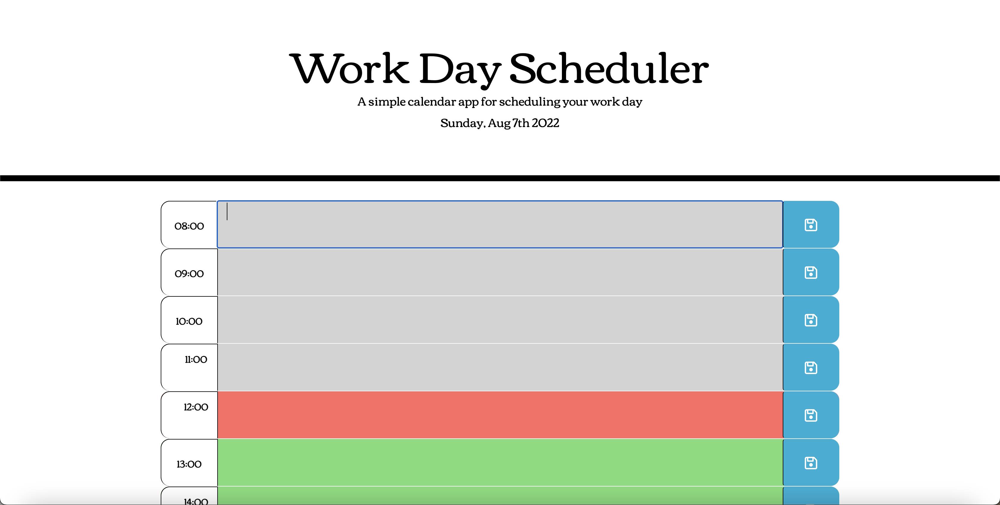

# WorkDayScheduler

## Description
A simple calendar application that allows for saved inputs for events for each hour during the work day.

The top of the calender shows the current date. The calendar is created for the standard 8am - 5pm workday, and is color coded to indicate whether the hours are in the past, present, or future. Events input into the different time blocks are saved and recalled when the page is refreshed.

## Screenshots

## Links
Repository: https://github.com/jasonsin88/WorkDayScheduler/
 
Deployed: https://jasonsin88.github.io/WorkDayScheduler/